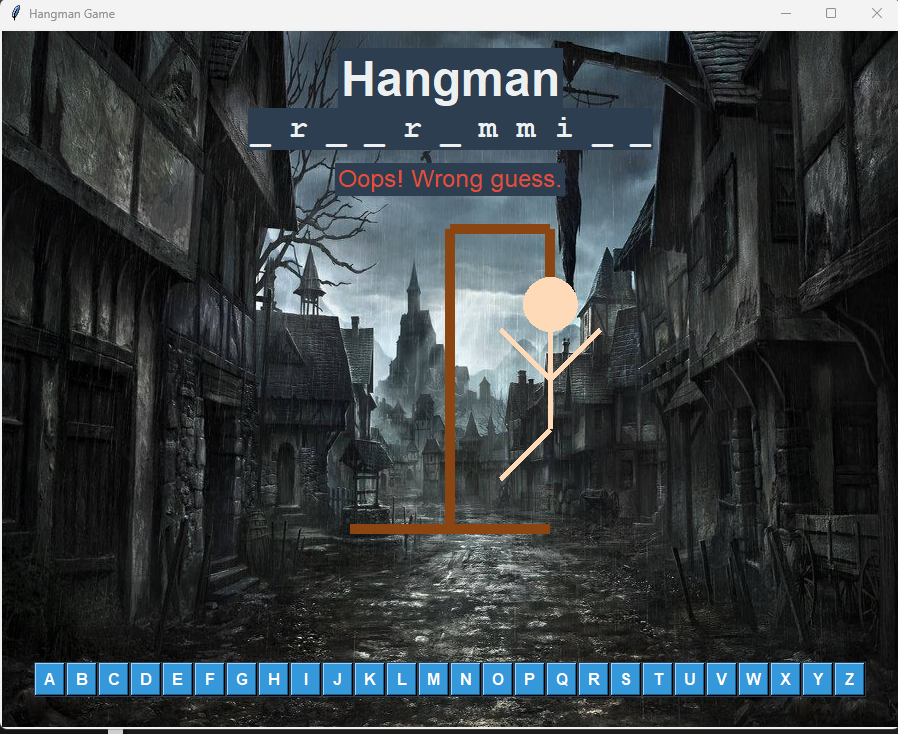

# Hangman Game

### Created by Alex Orr

# Python-based Hangman Game Project

### How to Play

The objective of the Hangman game is to guess the hidden word one letter at a time. You start with 6 lives. Each incorrect guess results in losing a life and drawing a part of the hangman. If you guess the word before your lives run out, you win. If you run out of lives, the game is over, and the word is revealed. It features sound effects including medieval background music, crowd cheering for correct answers, crowd booing for incorrect answers and a hanging sound for losing the game.



## Installation and Setup

**1. Clone the repository:**
```bash
git clone https://github.com/ShabalalaWATP/Hangman-Game.git
```
**2. Ensure you have Python installed:**
You can download it from python.org.


**3. Install the required libraries:**
```bash
pip install pygame
```
## Running the Game

Navigate to the directory where the game files are located and run the following command:

```bash
python hangman.py
```

## Code Explanation

The Hangman game is built using Python's Tkinter for the GUI and Pygame for the sound effects. Below is a detailed explanation of the code structure.

**Imports and Setup**
```python
import tkinter as tk
from tkinter import messagebox, font
import random
import pygame
import os
from PIL import Image, ImageTk
```
These lines import the necessary libraries for the GUI (tkinter), random word selection (random), sound effects (pygame), and file path handling (os).

**File Path Helper Function**
```python
script_dir = r"C:\Users\alexo\OneDrive\Documents\GitHub\Python Hangman"

def get_path(filename):
    return os.path.join(script_dir, filename)
```
This function helps in constructing the correct file paths for the sound files.

**HangmanGame Class**

The HangmanGame class contains all the logic for the game.

**Initialization**

```python
class HangmanGame:
    def __init__(self, master):
        self.master = master
        self.master.title("Hangman Game")
        self.master.geometry("900x700")
        
        self.bg_image = Image.open(get_path("hangman_image.jpg"))
        self.bg_image = self.bg_image.resize((900, 700), Image.LANCZOS)
        self.bg_photo = ImageTk.PhotoImage(self.bg_image)
        
        self.canvas = tk.Canvas(self.master, width=900, height=700)
        self.canvas.pack(fill="both", expand=True)
        self.canvas.create_image(0, 0, image=self.bg_photo, anchor="nw")
        
        self.words = ['python', 'programming', 'computer', 'science', 'algorithm', 'software', 'coding', 'neural', 'cybersecurity', 'network']
        self.word = random.choice(self.words)
        self.word_letters = set(self.word)
        self.used_letters = set()
        self.lives = 6
        
        self.setup_gui()
        self.setup_sound()
        self.reset_game()
```
The constructor initializes the game, sets up the GUI and sound, and resets the game state.

**GUI Setup**
```python
def setup_gui(self):
    title_font = font.Font(family="Helvetica", size=36, weight="bold")
    self.title = tk.Label(self.master, text="Hangman", font=title_font, bg="#2C3E50", fg="#ECF0F1")
    self.title.place(x=450, y=50, anchor="center")
    
    word_font = font.Font(family="Courier", size=24, weight="bold")
    self.word_display = tk.Label(self.master, text="", font=word_font, bg="#2C3E50", fg="#ECF0F1")
    self.word_display.place(x=450, y=100, anchor="center")
    
    self.letter_frame = tk.Frame(self.master, bg="#2C3E50")
    self.letter_frame.place(x=450, y=650, anchor="center")
    
    for char in 'ABCDEFGHIJKLMNOPQRSTUVWXYZ':
        btn = tk.Button(self.letter_frame, text=char, width=2, height=1,
                        command=lambda x=char: self.guess_letter(x),
                        font=("Helvetica", 12, "bold"),
                        bg="#3498DB", fg="white", activebackground="#2980B9")
        btn.pack(side=tk.LEFT, padx=1, pady=1)
    
    self.message_label = tk.Label(self.master, text="", font=("Helvetica", 18), bg="#2C3E50", fg="#ECF0F1")
    self.message_label.place(x=450, y=150, anchor="center")
```
The setup_gui method creates the game interface, including the title, canvas for drawing, word display, letter buttons, and message label.

**Sound Setup**
```python
def setup_sound(self):
    pygame.mixer.init()
    self.correct_sound = pygame.mixer.Sound(get_path("correct.wav"))
    self.wrong_sound = pygame.mixer.Sound(get_path("wrong.wav"))
    self.hanging_sound = pygame.mixer.Sound(get_path("hanging.mp3"))
    pygame.mixer.music.load(get_path("background.mp3"))
    pygame.mixer.music.set_volume(0.3)
    pygame.mixer.music.play(-1)
```
The setup_sound method initializes the sound effects and background music using Pygame.

**Game Reset**
```python
def reset_game(self):
    self.word = random.choice(self.words)
    self.word_letters = set(self.word)
    self.used_letters = set()
    self.lives = 6
    self.canvas.delete("all")
    self.canvas.create_image(0, 0, image=self.bg_photo, anchor="nw")
    self.draw_gallows()
    self.update_word_display()
    self.message_label.config(text="")
```
The reset_game method resets the game state, chooses a new word, and updates the display.

**Update Word Display**
```python
def update_word_display(self):
    display = ' '.join([letter if letter in self.used_letters else "_" for letter in self.word])
    self.word_display.config(text=display)
```
**Drawing Functions**
```python
def draw_hangman(self):
    stages = [
        self.draw_head,
        self.draw_body,
        self.draw_left_arm,
        self.draw_right_arm,
        self.draw_left_leg,
        self.draw_right_leg
    ]
    errors = 6 - self.lives
    for i in range(min(errors, len(stages))):
        stages[i]()

def draw_gallows(self):
    self.canvas.create_line(350, 500, 550, 500, width=10, fill="#8B4513")
    self.canvas.create_line(450, 500, 450, 200, width=10, fill="#8B4513")
    self.canvas.create_line(450, 200, 550, 200, width=10, fill="#8B4513")
    self.canvas.create_line(550, 200, 550, 250, width=10, fill="#8B4513")

def draw_head(self):
    self.canvas.create_oval(525, 250, 575, 300, width=5, outline="#FFDAB9", fill="#FFDAB9")

def draw_body(self):
    self.canvas.create_line(550, 300, 550, 400, width=5, fill="#FFDAB9")

def draw_left_arm(self):
    self.canvas.create_line(550, 350, 500, 300, width=5, fill="#FFDAB9")

def draw_right_arm(self):
    self.canvas.create_line(550, 350, 600, 300, width=5, fill="#FFDAB9")

def draw_left_leg(self):
    self.canvas.create_line(550, 400, 500, 450, width=5, fill="#FFDAB9")

def draw_right_leg(self):
    self.canvas.create_line(550, 400, 600, 450, width=5, fill="#FFDAB9")
```
These methods handle drawing the gallows and hangman parts on the canvas.

**Guessing Letters**
```python
def guess_letter(self, letter):
    if self.lives <= 0:
        return

    letter = letter.lower()
    if letter in self.used_letters:
        self.message_label.config(text="You already guessed that letter!")
        return
    
    self.used_letters.add(letter)
    
    if letter in self.word_letters:
        self.word_letters.remove(letter)
        self.play_sound(self.correct_sound)
        self.message_label.config(text="Good guess!", fg="#2ECC71")
    else:
        self.lives -= 1
        self.play_sound(self.wrong_sound)
        self.message_label.config(text="Oops! Wrong guess.", fg="#E74C3C")
        self.draw_hangman()
    
    self.update_word_display()
    
    if self.lives <= 0:
        self.draw_hangman()
        self.play_sound(self.hanging_sound)
        self.message_label.config(text="Game Over! You lost.", fg="#E74C3C")
        self.master.after(2000, lambda: messagebox.showinfo("Game Over", f"You lost! The word was {self.word}"))
        self.master.after(2000, self.reset_game)
    elif len(self.word_letters) == 0:
        self.message_label.config(text="Congratulations! You won!", fg="#2ECC71")
        self.master.after(2000, lambda: messagebox.showinfo("Congratulations", "You won!"))
        self.master.after(2000, self.reset_game)
```
The guess_letter method handles the logic for guessing letters, updating the game state, and playing sound effects.

**Main Loop**
```python
root = tk.Tk()
game = HangmanGame(root)
root.mainloop()
```
These lines create the main application window and start the game loop.

## This README provides a comprehensive overview of the Hangman game, including instructions on how to play, install, and run the game, as well as detailed notes on the code.


